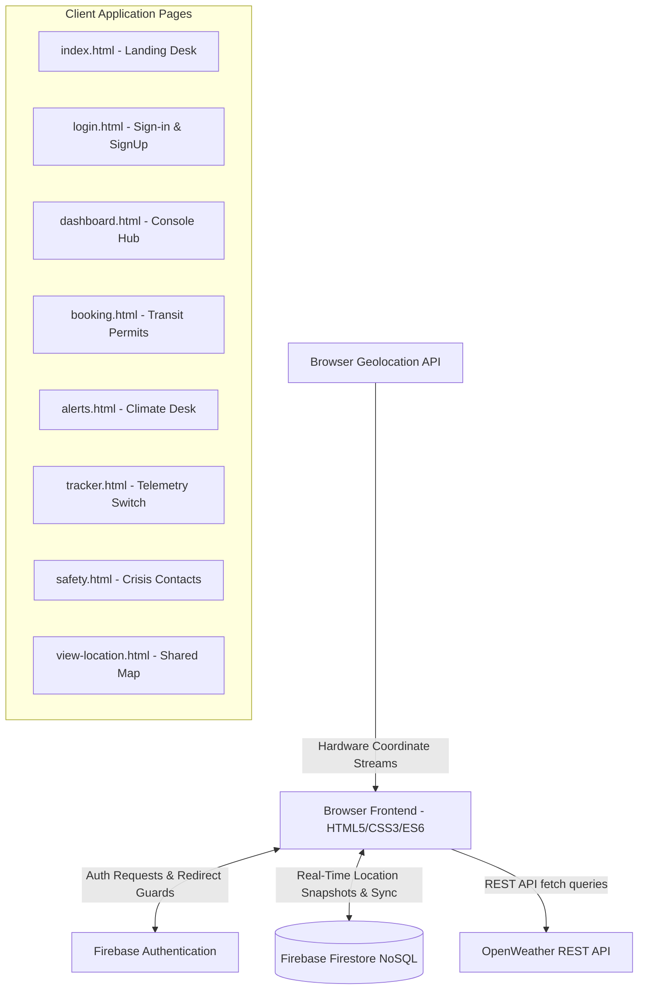
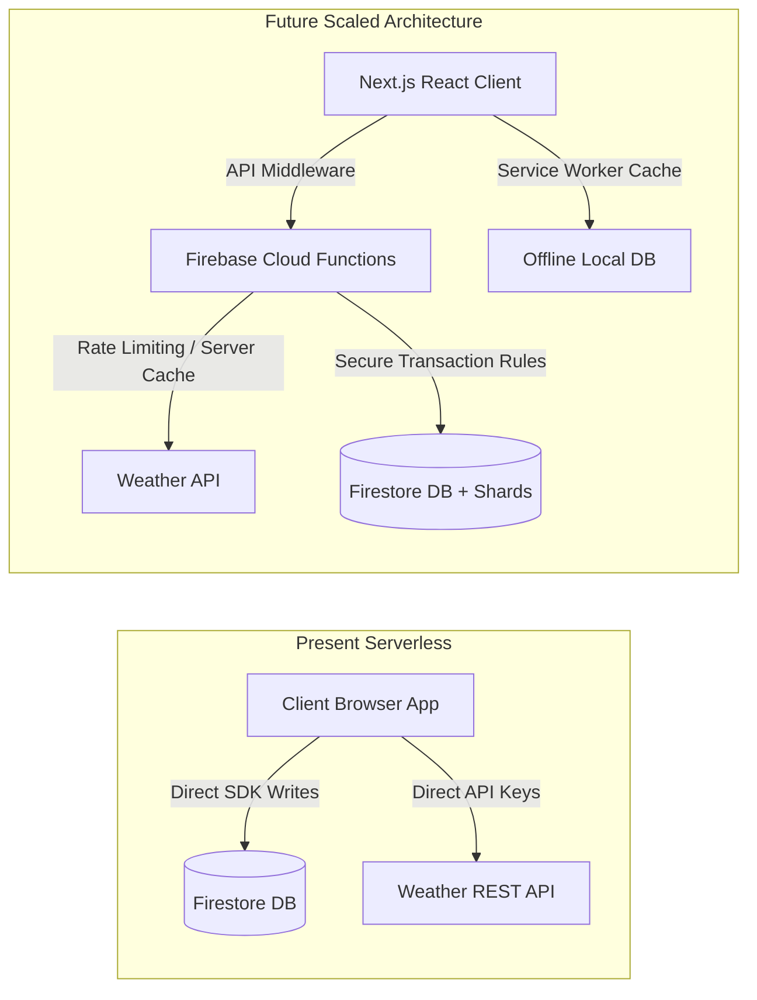

#  ExploreGuard — Smart Serverless Tourist Companion

ExploreGuard is a premium, responsive serverless web application designed to act as an active safety, climate advisory, and tracking companion for travelers navigating Northeast India. Built on a serverless architecture with real-time sync databases, it empowers travelers with critical tools such as meteorological warnings, booking simulation systems, instant emergency contact dialing, and peer-to-peer GPS coordinate telemetry sharing.

---

##  Architecture Diagram & Data Flow

ExploreGuard is built on a client-first, serverless architecture. Below is the simplified visualization of how the client browser, Firebase cloud services, and external meteorological REST endpoints communicate:



---

##  Project Structure

The project has been architected strictly adhering to the **Single Responsibility Principle**, separating layout (HTML5), static modular aesthetics (CSS3), dynamic controller logic (ES6 Modules), and third-party configuration parameters into highly maintainable modules.

```
exploreguard/
│
├── 📂 css/                           # Modular stylesheets for individual layouts
│   ├── global.css                   # Global CSS design variables, typography, and sticky nav
│   ├── index.css                    # Hero visual grids, feature cards, and statistics UI
│   ├── login.css                    # Full-screen dynamic backdrops and authentication layouts
│   ├── dashboard.css                # Visual user command panels, dynamic permits, and metrics
│   ├── booking.css                  # Sliding interactive wizards and permit transaction cards
│   ├── alerts.css                   # Meteorological panels, weather grids, and setup UI
│   ├── tracker.css                  # Live toggle switches, tracking dials, and map viewports
│   └── safety.css                   # Pulsating SOS controls and regional dial cards
│
├── 📂 js/                            # ES6 controller scripts managing database & APIs
│   ├── login.js                     # Firebase signup, sign-in, and redirect logic
│   ├── dashboard.js                 # Firestore user aggregate queries and cancellation handlers
│   ├── booking.js                   # Firestore permit generation writes and modals
│   ├── alerts.js                    # Weather queries, telemetry filters, and localStorage cache
│   ├── tracker.js                   # Geolocation watchPosition and real-time setDoc streams
│   ├── safety.js                    # Regional dialer queries and crisis checklists
│   └── view-location.js             # Firestore onSnapshot listener for recipient WebSocket mapping
│
├── 📄 config.js                      # Git-ignored local variables (Created from template)
├── 📄 config.example.js              # Version-controlled configuration parameter template
├── 📄 firebase-config.js             # Shared serverless DB and Authentication entry point
│
├── 📄 index.html                     # Public marketing and entry page
├── 📄 login.html                     # Auth interface (Sign in / Registration)
├── 📄 dashboard.html                 # Unified dashboard aggregation panel
├── 📄 booking.html                   # Travel permits & transit booking engine
├── 📄 alerts.html                    # Weather advisories & safety warnings console
├── 📄 tracker.html                   # Geolocation tracking panel
├── 📄 safety.html                    # Local crisis emergency SOS directory
├── 📄 view-location.html             # Real-time WebSocket coordinator live map
│
└── 📄 .gitignore                     # Git-tracking boundary exclusions (excludes config.js)
```

---

## ⚙️ Core Modules & How They Work

### 1. Unified Authentication (`login.html` & `js/login.js`)
Secures user portals utilizing **Firebase Authentication**. Features dynamic ES6 lifecycle state hooks (`onAuthStateChanged`). Active route-guards monitor sessions, automatically redirecting authenticated users to the dashboard and locking down pages from unauthenticated access.

### 2. Meteorological Safety Advisory Desk (`alerts.html` & `js/alerts.js`)
Fetches live regional climate conditions using the **OpenWeather REST API**. 
* **Prioritized Key Resolution:** Resolves OpenWeather credentials via a prioritized security model (checks Browser `localStorage` ➔ `window.CONFIG.js`).
* **Interactive Client Fallback:** If the repository is deployed on a public host (e.g. GitHub Pages) where private keys are hidden/absent, the UI dynamically displays a sleek glassmorphic configuration widget allowing visitors to key in their own API key, which is saved locally to their browser.
* **Intelligent Advisories:** Inspects condition metrics (visibility, wind velocities, active precipitation) to automatically output dynamic safety warning banners (Safe/Caution/Critical Threat).
* **Reset & Rotation:** Users can instantly click a "Reset Key" button to delete credentials from storage, enabling clean key rotation.

### 3. Geolocation Coordinate Sharing (`tracker.html` & `js/tracker.js`)
Initiates high-accuracy traveler coordinates tracking using the browser's hardware **Geolocation API** (`navigator.geolocation.watchPosition`). 
* Every location callback translates to an asynchronous Firestore `setDoc` operation, overwriting coordinates telemetry in the `locations/{userId}` document.
* **Privacy-First:** Location streams only initiate under explicit toggle toggles. Disabling the toggle stops the sensor hardware instantly and triggers a `deleteDoc` operation to erase traveler telemetry from the cloud, preventing background tracking.

### 4. Recipient WebSocket Tracking (`view-location.html` & `js/view-location.js`)
Lightweight view page shared with trusted family or rescue coordinators.
* It parses the traveler's user ID directly from the URL query string (`?uid=...`).
* Binds an active, persistent connection using a **Firestore Real-Time Listener** (`onSnapshot`).
* Because Firestore maintains WebSocket tunnels, traveler updates instantly trigger recipient map adjustments and coordinates plotting.
* If the traveler disables tracking, the Firestore document is deleted, which automatically notifies the recipient.

---

## 🚀 Setting Up & Running Locally

Since ExploreGuard is built on a serverless architecture, it runs entirely in the browser without requiring a heavy server-side setup.

### 1. Clone the Repository
```bash
git clone https://github.com/YOUR_USERNAME/exploreguard.git
cd exploreguard
```

### 2. Configure Your Keys
Create a local `config.js` file from the repository template:
```bash
cp config.example.js config.js
```
Open `config.js` in a text editor and add your private OpenWeather API key:
```javascript
window.CONFIG = {
  OPENWEATHER_API_KEY: 'YOUR_API_KEY_HERE'
};
```
*Note: `config.js` is automatically excluded in `.gitignore` to protect it from being exposed on GitHub.*

### 3. Launch a Local Web Server
You can open `index.html` directly, or serve it using a lightweight local development server:
* Using VS Code's **Live Server** extension.
* Or using Python:
  ```bash
  python -m http.server 8000
  ```
Open your browser to `http://localhost:8000`.

---

##  Scalability Analysis: Present & Future

### Present Scalability
ExploreGuard is designed to scale dynamically out-of-the-box:
1. **Serverless Infrastructure Scaling:** By utilizing **Firebase Auth** and **NoSQL Cloud Firestore**, database scaling is handled automatically. The system adapts from 1 to 100,000+ simultaneous read/write cycles without requiring system administrator provisioning or VM hosting costs.
2. **Decoupled Key Management:** Isolating key definitions within a gitignored `config.js` and combining it with a browser `localStorage` user input fallback means the app can run on static web hosts (GitHub Pages, Netlify) for free with zero API cost overhead for the developer.
3. **Local Caching & Performance:** Custom browser configurations minimize recurrent round-trips to remote weather endpoints. Assets, icons (loaded via highly optimized SVG CDN Lucide), and design variables are served fully on the client-side, reducing latency.

### Future Scalability Roadmap
As the user base expands, the system is designed to transition to the following architectures:



1. **API Key Protection via Serverless Middleware (Backend Proxy):**
   * *Problem:* On a public live site, client-side API keys can be observed in browser network panels.
   * *Solution:* Migrate key retrievals to **Firebase Cloud Functions** (Node.js backend proxy). The client makes requests directly to your cloud function (e.g. `/api/weather?city=Imphal`), and the function securely queries OpenWeather using environment variables hidden on the server, injecting rate limiting and server-side weather caching.
2. **Framework Migration (Next.js / Vite React):**
   * Migrate the codebase into a component-driven Single Page Application (SPA). This enables unified state management, component reusability (e.g. unified card interfaces), and client-side page transitions.
3. **Firestore Scale Optimization:**
   * *Shard-based coordinate collections:* Active GPS tracking causes heavy writes. As concurrent users scale, coordinates collections will implement write sharding and optimized composite indexing to optimize query throughput.
   * *Advanced Database Security Rules:* Enforce granular write security, ensuring location documents can only be created by authenticated owners and queried exclusively by authorized coordinators.
4. **Offline Resilience & PWA Capabilities:**
   * Northeast India features rugged mountainous terrain where internet connections are spotty. 
   * Integrating a **Progressive Web App (PWA)** shell will leverage standard Service Workers to cache critical emergency data offline. 
   * Firestore's **Offline Persistence** will be enabled, so travelers can still register permit details and track GPS coordinate trails offline. Once cellular signal is recovered, the queues will automatically sync back to the cloud.
