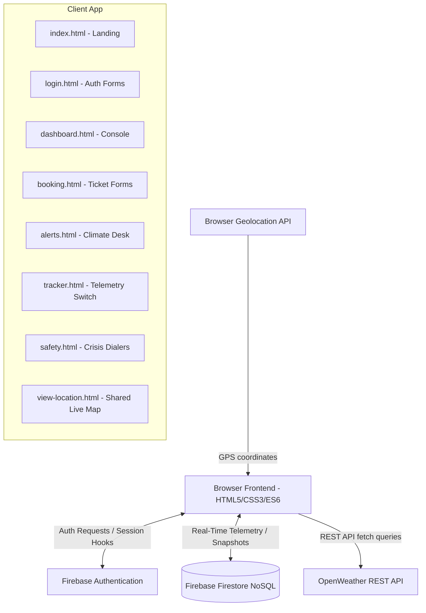

# ExploreGuard - Technical Interview Prep & Resume Notes

Use this guide to prepare for your upcoming developer interview. It breaks down the system's architecture, data flows, file-by-file logic, and common interview questions so you can explain your work confidently to a hiring manager.

---

## 📝 How to Describe ExploreGuard on Your Resume

**ExploreGuard - Smart Serverless Tourist Companion App**
> *Developed a premium serverless web application to assist travelers navigating Northeast India with real-time safety, ticketing, and live geolocation-sharing utilities.*
> 
> - **Modern Responsive UI:** Designed a responsive, mobile-first frontend using HTML5, CSS3 Custom Properties, Glassmorphism, and Lucide vector icons.
> - **Real-Time Database & Telemetry:** Engineered a peer-to-peer coordinates sharing module using the browser's Geolocation API (`navigator.geolocation.watchPosition`) synchronized in real time with a serverless **NoSQL Firebase Firestore** database.
> - **State Management & Auth:** Secured user portals using **Firebase Authentication**, persisting session states with active ES6 modular redirection guards.
> - **REST API Integration:** Implemented client-side integrations with the OpenWeather REST API to parse and display real-time climate telemetry and automatically generate safety warnings (heavy precipitation, mudslide risks, impaired driving visibility).

---

## 🏛️ System Architecture & Data Flow

Below is a simplified architecture of how the components of **ExploreGuard** communicate:

---

## 📂 File-by-File Deep Dive (Study Sheets)

### 1. `firebase-config.js` (The Serverless Entry Point)
- **What it does:** Initializes the Firebase connection and exports the global `auth` (Authentication service) and `db` (Firestore Database database handle).
- **Core Technology:** ES6 module imports using standard Firebase Web SDK v10 packages.
- **Interviewer Talking Point:** *"I decoupled database initialization into a single config file. This adheres to the **Single Responsibility Principle**, ensuring that credentials are kept in a single module and database hooks can be cleanly imported across different dashboard components."*

---

### 2. `index.html` (Premium Landing Page)
- **What it does:** Serves as the public marketing landing page. It showcases core features and statistics, directing users to register/log in.
- **Design Highlights:** Sticky glassmorphic navbar (`backdrop-filter: blur(12px)`), responsive columns matching viewport sizes, CSS custom variables, and hover lift effects for interactive feature cards.
- **Interviewer Talking Point:** *"I utilized **CSS3 Custom Properties** (variables) to maintain a unified color palette and design tokens, ensuring visual consistency. I replaced default browser emojis with sharp vector SVG **Lucide Icons** to make the landing page feel highly professional and modern."*

---

### 3. `login.html` (Authentication & Security Portal)
- **What it does:** Manages traveler sign-in and account registration.
- **Core Technology:** Firebase Auth (`signInWithEmailAndPassword`, `createUserWithEmailAndPassword`, `onAuthStateChanged`).
- **Data Flow:**
  1. User fills forms (Name, Email, Password).
  2. Firebase Auth registers the user and creates an encrypted credential node.
  3. A new user document containing profile details is created in the Firestore NoSQL database (`setDoc(doc(db, 'users', uid), ...)`).
- **Interviewer Talking Point:** *"To secure user sessions, I implemented active state hooks (`onAuthStateChanged`). If the traveler is already authenticated, they are automatically bypassed into their dashboard, preventing duplicate sign-ins. I designed a premium glassmorphic login card over a full-screen blurred scenic backdrop."*

---

### 4. `dashboard.html` (Unified User Control Console)
- **What it does:** Serves as the user's primary command center, showing quick-access utilities and managing booked travel passes.
- **Core Technology:** Firestore Firestore Queries (`collection`, `query`, `where`, `orderBy`, `getDocs`, `deleteDoc`).
- **Data Operations:** Performs a **READ** operation querying all documents inside the `'bookings'` collection belonging to the active traveler's `userId`, ordered by creation timestamp. Also manages **DELETE** operations allowing users to cancel bookings directly.
- **Design Highlights:** Booking data is formatted as vector boarding passes showing type badges (`FLIGHT`, `RAILWAY`, `CAB`) and metadata icons.
- **Interviewer Talking Point:** *"The dashboard acts as an aggregator. It performs real-time queries against our NoSQL Firestore collection to compile user travel itineraries. I formatted this dynamically in the DOM as clean boarding pass tickets with inline cancel triggers."*

---

### 5. `booking.html` (Ticket Reservation Center)
- **What it does:** Allows authenticated travelers to reserve flights, trains, and cabs.
- **Core Technology:** Firestore Firestore writes (`addDoc`, `collection`).
- **Data Operations:** Performs **CREATE** operations, storing travel itineraries directly in the `'bookings'` collection.
- **Design Highlights:** Sliding interactive tabs using CSS transitions, and an animated success modal that triggers using custom cubic-bezier timing curves.
- **Interviewer Talking Point:** *"I created an interactive ticket booking wizard. It captures user inputs and structures them as document payloads in Firestore. It tracks creation dates and user IDs so that database queries are granularly secured."*

---

### 6. `alerts.html` (Safety & Meteorological Desk)
- **What it does:** Displays weather data for popular tourist spots in Northeast India and raises intelligent travel warnings.
- **Core Technology:** REST APIs (`fetch`), async/await, JSON parsing, OpenWeather REST services.
- **Business Logic:** Automatically evaluates climate details (e.g., condition code is `'Thunderstorm'`, precipitation is high, or visibility is under 1km) to output dynamic alerts mapping color-coded states (Optimal Safe = green, Caution advisory = orange, Critical warning = red).
- **Interviewer Talking Point:** *"This component leverages the **OpenWeather REST API** asynchronously. When a traveler inputs or clicks a city chip, a promise-based fetch request is made. The response JSON is parsed to extract key fields (visibility, feels-like, wind speed) and dynamically renders customized threat advisory cards."*

---

### 7. `tracker.html` (GPS Telemetry Console)
- **What it does:** Allows the traveler to start or stop sharing their live coordinates with trusted nodes.
- **Core Technology:** Geolocation API (`watchPosition`, `clearWatch`), Firestore writes (`setDoc`, `deleteDoc`).
- **Business Logic:** 
  1. The user activates an iOS-style toggle.
  2. The Geolocation API initiates high-accuracy tracking. Every time the traveler moves, a success callback receives the new coordinates.
  3. The updated coordinates are immediately updated on a Firestore document at `locations/{userId}` and plotted on an embedded Google Map frame.
  4. Disabling the toggle stops the sensor watcher and deletes the location document from Firestore to preserve privacy.
- **Interviewer Talking Point:** *"I designed this around a **Privacy-First principle**. Location telemetry only initiates under explicit user toggle consent and stream updates directly on Firestore using `setDoc`. When disabled, the geolocation sensor is released and the database document is completely deleted to prevent background profiling."*

---

### 8. `safety.html` (Crisis & Emergency Contacts Portal)
- **What it does:** Houses emergency SOS triggers and localized police, ambulance, and search services.
- **Design Highlights:** Crimson SOS panel featuring a pulsating ring (`keyframes pulse-ring`), click-to-call integrations (`href="tel:..."`), and clean safety advisory checklists.
- **Interviewer Talking Point:** *"This portal acts as a localized emergency directory. Travelers select a district, and the app instantly structures telephone pathways and hospital dials. It provides a visual, high-impact SOS call button designed for rapid crisis support."*

---

### 9. `view-location.html` (The Live Recipient Map View)
- **What it does:** A public, lightweight tracking page sent to trusted contacts so they can follow the traveler's movement on a map.
- **Core Technology:** Firestore Real-Time Listener (`onSnapshot`, `doc`).
- **Data Flow:**
  1. The page parses the traveler's user ID from the URL (`?uid=...`).
  2. It establishes a live listener connection using Firestore `onSnapshot`.
  3. Every time the traveler's coordinates update, the listener triggers, updating the visual coordinate dials and automatically repositioning the traveler's avatar on an embedded Google Map.
  4. If the traveler turns off their tracker, the Firestore document is deleted, which immediately triggers the listener to close and notify the recipient that tracking has safely ended.
- **Interviewer Talking Point:** *"To make the tracker fully functional, I engineered a dedicated recipient page. It uses **Firestore onSnapshot listeners** to open a real-time WebSocket connection to the database document. Every movement of the traveler updates the map instantly, providing a seamless tracking console for the traveler's family."*

---

## ❓ Frequently Asked Interview Questions (With Exemplary Answers)

### Q1: Why did you choose a Serverless (Firebase) architecture instead of building a traditional Express.js/Node.js backend?
> **Answer:** *"For a security and safety-critical tourist companion app like ExploreGuard, a serverless architecture using Firebase offers massive benefits in terms of deployment speed, scaling, and operational efficiency. By leveraging Firebase Authentication and Firestore, we eliminate the overhead of hosting, configuring, and securing a database VM. More importantly, Firestore uses a highly optimized NoSQL architecture with built-in WebSockets, which makes real-time features—like live coordinates streaming—extremely simple and resource-efficient to implement compared to setting up a custom Socket.io server from scratch."*

### Q2: How does real-time streaming work under the hood in your Geolocation sharing system?
> **Answer:** *"It's a client-to-database-to-client pipeline. On the traveler's side (`tracker.html`), I use the browser's `navigator.geolocation.watchPosition` API. Every time the hardware sensor detects a change in location, it triggers a callback that executes an asynchronous Firestore `setDoc` operation, overwriting the document `locations/{userId}` with new latitude, longitude, and accuracy telemetry. On the viewer's side (`view-location.html`), the page parses the traveler's UID and binds an `onSnapshot` listener to that exact document. Firestore keeps an open WebSocket channel; the moment the document changes in the cloud, Firestore pushes the delta back to the viewer's browser, which automatically updates the DOM and map frame instantly."*

### Q3: How did you handle responsive image styling and text readability?
> **Answer:** *"When working with heavy background photography, keeping text legible on all viewports is crucial for accessibility. I generated responsive sceneries of Northeast India and bound them to sections via CSS. To guarantee readable white typography, I styled the background elements using a stacked CSS system: `background-image: linear-gradient(rgba(15, 23, 42, 0.4), rgba(15, 23, 42, 0.75)), url('img.png');`. This layers a dark, semi-transparent gradient on top of the image but beneath the text. Coupled with responsive media queries, fluid sizing (`clamp()`), and glassmorphism panels using `backdrop-filter: blur()`, the interface adapts gracefully to mobile screens while maintaining perfect contrast."*
